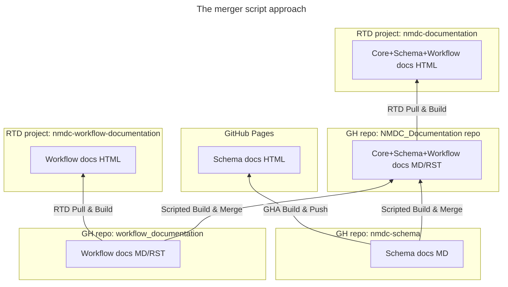
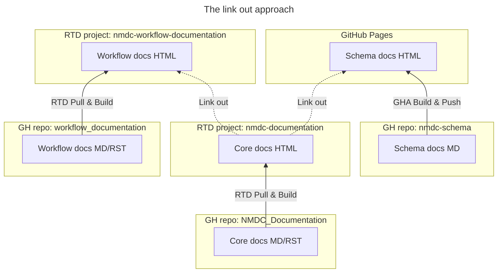

# Simplify setup for documentation building

## Context and Problem Statement

Currently, the [NMDC documentation site](https://nmdc-documentation.readthedocs.io/) is generated by combining contents from two upstream Git repositories (i.e. [`nmdc-schema`](https://github.com/microbiomedata/nmdc-schema/) and [`workflow_documentation`](https://github.com/microbiomedata/workflow_documentation)) with the contents of a third one (i.e. [`NMDC_Documentation`](https://github.com/microbiomedata/NMDC_documentation)); merging all of those contents into a single, Sphinx-compatible file tree; committing that file tree to the third repository; and initiating a "Pull & Build" step via the **Read the Docs** (RTD) website. This involves manual steps, and merger scripts that will require ongoing maintenance.

Meanwhile, the `nmdc-schema` and `workflow_documentation` maintainers each already have their own routines for deploying their respective projects' documentation to the Internet (i.e. [here](https://microbiomedata.github.io/nmdc-schema/) and [here](https://nmdc-workflow-documentation.readthedocs.io/), respectively). As a result, there are two copies of the `nmdc-schema` documentation on the Internet at the same time (i.e. one deployed by the `nmdc-schema` maintainers and one deployed—independently—by the `NMDC_Documentation` maintainers), which leaves open the possibility that the copies fall out of sync with one another. The same is true about the `workflow_documentation` project documentation.

We want to avoid the **ongoing maintenance** of the merger scripts, the **manual steps** of running them, and the **duplication of documentation**.

## Considered Options

1. Continue using the "merger script" approach (see problem statements above).

2. Switch to a "link out" approach. Instead of merging the documentation into a single site, we will update the core documentation (one time) so that it prominently displays links to the two other documentation sites. That will eliminate both the merge step and the duplication of documentation\*. 

   > \***Caveat:** In order to avoid breaking any existing links that our readers may have saved, we will refrain from deleting the already-merged-in content for now. We may eventually replace that content with redirects, or discard it altogether (TBD). We will not continue to update it, though—it will remain in its current state even as the core documentation around it gets updated.

## Decision Outcome

- **Chosen option:** 2. Switch to a "link out" approach.

## Future Considerations

- [ ] Move the core documentation and the workflow documentation from Read the Docs to GitHub Pages in an attempt to simplify account management.
- [x] Move ADRs out of the `NMDC_Documentation` repo and into a repo more suitable for project management (i.e. the `issues` repo).
