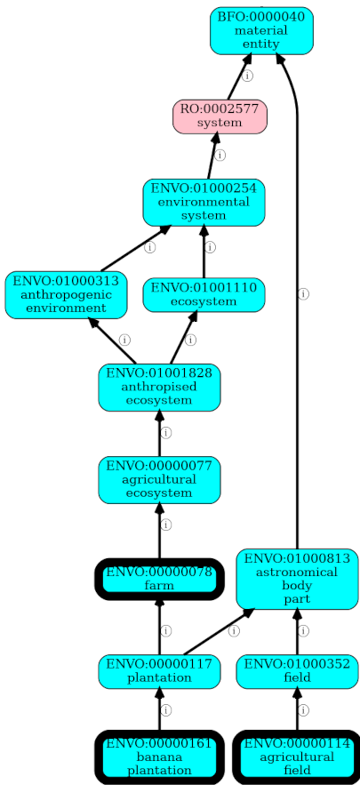

# Establishing Reasonable Values for MIxS Environmental Triad Slots

## Context and Problem Statement

Determining what values to populate into each of the environmental triad slots (`env_broad_scale`, `env_local_scale`,
and `env_medium`) is difficult, especially when further broken down into reasonable `env_broad_scale` values for Soil
sample, Water samples, etc. Although it is challenging, it adds value to the NMDC ecosystem in terms of finding and
grouping similar Biosamples.

NMDC will establish reproducible logic to provide users with value sets, i.e. curated lists of reasonable terms, for
each slot. The value sets will be implemented as enumerations in the submission-schema, and will be composed in the MIxS
style: the label for a class from a high quality ontology, followed by the class' CURIe, inside of square brackets. For
example, one reasonable `env_broad_scale` for a Soil sample _might_ be 'temperate grassland biome [ENVO:01000193]'

These value sets are not necessarily intended to be closed indefinitely. An environmental triad slot could be given an
enumeration, or a regular expression pattern as constraints. This could be a temporary allowance while NMDC's logic is
being refined. Values that match the regular expression but do not come from the enumeration will need to be reviewed on
a regular basis, as submitters could provide values that have typos, that have CURIe/label mismatches, or just are not
reasonable values for the slot.

*This ADR is in progress. The initial plan has been outlined here and may change.*

## Decision Outcome

NMDC environment-specific value sets for the environmental triad slots will be generated by processes that emphasize
reusability and generalizability. Specifically, code has been developed to generate tables of candidates for each value
set, with columns of theoretical and empirical supporting evidence.

The theoretical evidence is based
on [guidance provided by the EnvO and MIxS authors](https://github.com/EnvironmentOntology/envo/wiki/Using-ENVO-with-MIxS),
along with structure of the ontologies whose classes are included in the value sets. Furthermore, the technology for
extracting subsets from those ontologies will be queries composed with
the [Ontology Access Kit](https://github.com/INCATools/ontology-access-kit). For example, NMDC may set the general rule
that the values for the `env_broad_scale`, in combination with all environmental sample types, must be subclasses
of [biome [ENVO:00000428]](https://www.ebi.ac.uk/ols4/ontologies/envo/classes/http%253A%252F%252Fpurl.obolibrary.org%252Fobo%252FENVO_00000428?lang=en).
In that case, the `env_broad_scale` values sets for individual environments/sample types must be subsets of the general
query.

The empirical evidence is based on values that have been used for the environmental triad slots in prominent Biosample
metadata systems, such as NCBI, GOLD, and NMDC. Some of those sources, especially NCBI, are very permissive for the
environmental triad values. Because the candidate value tables include multiple empirical sources plus the results of
the general, rules-based OAK queries, no one source can introduce inappropriate values nor exclude reasonable values.
Initial exploration suggests that the queries will be hard limits for `env_broad_scale` and `env_medium`, but that the
empirical evidence will be more important for `env_local_scale`. General, rules-based queries will be refined for each
of the environments (MIxS Extensions), and will be reflected in either query-specific columns or general boolean
columns, like 'is_biome' or 'is_environmental_material'.

- The environmental triad squad is developing an NMDC-prioritized list of environments. Soil will be completed first.
- This ADR will be updated as environment-specific queries are created.
- The logic described above is intended to minimize cherry-picking of values for the sets, but individual squad members
  will be given the opportunity to add their own `Y` or `N` votes for each value in the tables. It may be possible to
  feed the insights from these votes back into reusable logic, but that might require complex OAK queries over
  inconsistent annotations, or grouping of values within a semantic embedding space. For example, there may be evidence
  that [farm [ENVO:00000078]](https://www.ebi.ac.uk/ols4/ontologies/envo/classes/http%253A%252F%252Fpurl.obolibrary.org%252Fobo%252FENVO_00000078),
  [agricultural field [ENVO:00000114]](https://www.ebi.ac.uk/ols4/ontologies/envo/classes/http%253A%252F%252Fpurl.obolibrary.org%252Fobo%252FENVO_00000114)
  and [banana plantation [ENVO:00000161]](https://www.ebi.ac.uk/ols4/ontologies/envo/classes/http%253A%252F%252Fpurl.obolibrary.org%252Fobo%252FENVO_00000161)
  should all be included in the `env_local_scale` enumeration for Soil samples. It may be more expeditious for
  a human to make the judgment call to include farm and exclude the others, compared to the effort required to automate
  that. Visualizations will be provided to illustrate these cases. See the end of this ADR.
- As necessary, we can request that EnvO add classes in support of this work, or that more (and more consistent) axioms
  are added to existing classes.

## NMDC General Queries for Environmental Triad Value Sets

- `env_broad_scale` will consist of subclasses
  of [biome [ENVO:00000428]](https://www.ebi.ac.uk/ols4/ontologies/envo/classes/http%253A%252F%252Fpurl.obolibrary.org%252Fobo%252FENVO_00000428),
  with the exception of host-associated samples, including plant-associated samples.
- `env_local_scale` will consist of subclasses
  of [material entity [BFO:0000040]](https://www.ebi.ac.uk/ols4/ontologies/envo/classes/http%253A%252F%252Fpurl.obolibrary.org%252Fobo%252FBFO_0000040?lang=en),
  minus biome [ENVO:00000428]
  and [environmental material [ENVO:00010483]](https://www.ebi.ac.uk/ols4/ontologies/envo/classes/http%253A%252F%252Fpurl.obolibrary.org%252Fobo%252FENVO_00010483)
    - It's expected that additional branches of the is_a hierarchy will subtracted,
      like [chemical entity [CHEBI:24431]](https://www.ebi.ac.uk/ols4/ontologies/envo/classes/http%253A%252F%252Fpurl.obolibrary.org%252Fobo%252FCHEBI_24431)
    - The possibility of subtracting leaf nodes is under consideration. Since we are programmatically building candidate
      tables with multiple forms of evidence, the smaller query result offered by subtraction may not be of much added
      benefit
    - Subtraction over relationships other than is_a, subtraction of classes based on substrings in their labels, or
      other targets subtraction are possible, but may also be of limited benefit
    - @turbomam
      has [prototyped these workflows in Makefiles](https://github.com/microbiomedata/external-metadata-awareness/blob/main/Makefiles/soil-env_local_scale.Makefile).
      @sierra-moxon will explore options for making the workflows more accessible to the whole group, with a single
      application that takes a single configuration file, or with (a) Jupyter notebook(s)
- `env_medium` will consist of subclasses environmental material [ENVO:00010483]

For **soil** environment (MIxS Extension)

- `env_broad_scale` will
  exclude [aquatic biome [ENVO:00002030]](https://www.ebi.ac.uk/ols4/ontologies/envo/classes/http%253A%252F%252Fpurl.obolibrary.org%252Fobo%252FENVO_00002030)
    - See comments about the cost and benefits of excluding leaf nodes above
- `env_local_scale` ????? TBC
- `env_medium`
    - Subclass hierarchy-based exclusion _could_ also be used here, for
      example [hydrocarbon-based environmental material [ENVO:2000045]](https://www.ebi.ac.uk/ols4/ontologies/envo/classes/http%253A%252F%252Fpurl.obolibrary.org%252Fobo%252FENVO_2000045?lang=en)
    - Textual filtering over labels, with or without regular expressions or stemming, _could_ also be used
        - food, water and ice terms could be removed without stemming
        - stemming with the pattern 'ferment' could be used to remove terms with fermented or fermenting in their labels
    - But there's a good chance that the empirical ranking of the environmental material classes will have a better
      cost/benefit profile (at least initially) than writing a library of rules.

This ADR will be updated following the evaluation of these initial queries, followed by human review and voting.

## More Information

* Reference the squad meeting notes.
* https://github.com/microbiomedata/issues/issues/468
* https://github.com/microbiomedata/issues/issues/840
* https://github.com/microbiomedata/issues/issues/841
* https://github.com/microbiomedata/issues/issues/877

## Illustration of farm/agricultural field/banana plantation paths

```shell
poetry run runoak --input sqlite:obo:envo viz --predicates i 'farm' 'agricultural field' 'banana plantation'
```

